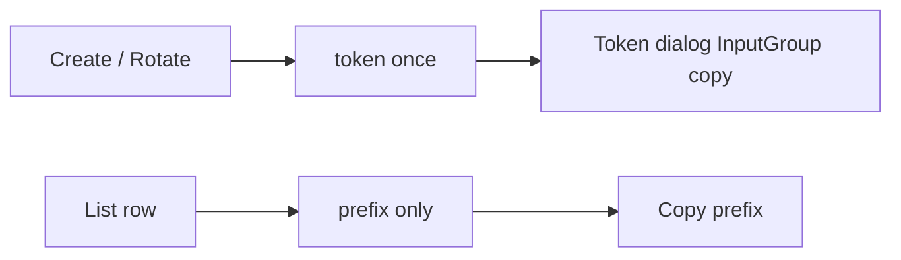

# Доработка страницы Доступов (form-8)

## Контекст

- Preview: [form-8](https://reui.io/preview/base/form-8) · Docs: [blocks](https://reui.io/blocks)
- Сейчас: [`apps/web/src/routes/_auth/access.tsx`](apps/web/src/routes/_auth/access.tsx) + [`access-api-keys-card.tsx`](apps/web/src/components/access/access-api-keys-card.tsx) / [`access-api-keys-grid.tsx`](apps/web/src/components/access/access-api-keys-grid.tsx) / [`api-key-token-dialog.tsx`](apps/web/src/components/access/api-key-token-dialog.tsx)
- Полный секрет токена API отдаёт **только** в `201` create / `200` rotate; в списке есть лишь `prefix` (8 символов). Копирование «ключа» в таблице = **prefix**; полный токен — в диалоге после создания/ротации.
- Уже есть хук [`useCopyToClipboard`](apps/web/src/hooks/use-copy-to-clipboard.ts) и DNA копирования в [`settings-14/.../columns.tsx`](apps/web/src/components/blocks/settings-14/components/columns.tsx) (`ApiKeyCell`).
- `InputGroup` уже в [`packages/ui/src/components/input-group.tsx`](packages/ui/src/components/input-group.tsx).



## Подход

Сохранить KPI + сессию + DataGrid-список (раздел в целом ок). Оформить блок ключей и диалог токена по form-8 (Frame/Alert/InputGroup copy), не переписывать страницу целиком.

## Шаги

### 1. Установить референс form-8

Из `apps/web`:

```bash
pnpm dlx shadcn@latest add @reui/form-8 --yes
```

Сложить в `apps/web/src/components/blocks/form-8/` (reference). Post-add: импорты shadcn → `@evobgp/ui/components/*`. Не копипастить block в route — adapt в domain-компоненты.

### 2. Диалог полного токена (главное копирование)

Переработать [`api-key-token-dialog.tsx`](apps/web/src/components/access/api-key-token-dialog.tsx) по form-8:

- ReUI `Alert` (`warning`): «токен больше не покажем»
- `InputGroup` + read-only input (masked toggle reveal/hide) + кнопка Copy (`useCopyToClipboard` + toast)
- Доп. кнопка/строка: копировать `Authorization: Bearer <token>` (удобно для curl/UI settings)
- Автофокус / явный CTA «Копировать»

### 3. Таблица ключей — copy + больше info

В [`access-api-keys-grid.tsx`](apps/web/src/components/access/access-api-keys-grid.tsx):

- Ячейка **prefix**: mono + Copy (как `ApiKeyCell` в settings-14); tooltip «полный токен недоступен — только prefix»
- Добавить колонки: **создан** (`created_at`), **id** (mono, copy)
- Name-cell: hybrid tile DNA (icon `KeyRound` на `bg-muted`) + subtitle с role badge
- Actions: оставить rotate/revoke; при необходимости ButtonGroup как в form-8

Маленький shared helper при необходимости: `apps/web/src/components/access/copyable-mono.tsx` (reuse в grid + session).

### 4. Оболочка блока ключей

В [`access-api-keys-card.tsx`](apps/web/src/components/access/access-api-keys-card.tsx):

- Заменить `DataGridCard` на ReUI `Frame` / `FramePanel` (+ header) — surface lock form-8 / contract
- Короткий `Alert` info над гридом: полный токен только при создании/ротации; в списке копируется prefix

### 5. Сессия — доп. info + copy

В [`access.tsx`](apps/web/src/routes/_auth/access.tsx):

- Copy для `tenant_id` (и `user_id`, если есть)
- Для JWT: показать `is_admin` badge и число permissions (без смены layout)

### 6. Проверка

```powershell
pnpm --filter @evobgp/web run typecheck
pnpm --filter @evobgp/web run lint
pnpm --filter @evobgp/web run build
```

## Вне скоупа

- Смена backend (reveal полного токена из БД невозможен — SHA-256)
- Полный redesign KPI (`SectionCards` → `KpiStatGrid`) — отдельная задача
- Перенос списка с DataGrid на row-list form-8
