# Анализ compose без NATS: нужен ли рефакторинг EvoBGP?

## Вердикт

**Нет — оптимизировать текущий Go-код под этот compose не нужно.** Приложение уже спроектировано как monolith (`evobgp-all`) с in-process очередью. NATS в репозитории — задел на будущее, не рабочая зависимость.

## Как устроен runtime без брокера

```mermaid
flowchart LR
  subgraph host [Хост /opt/evobgp]
    Web[evobgp-web nginx]
    All[evobgp-all]
    PG[(postgres)]
    Bird[bird2]
    Agent[evobgp-agent]
    Edge[evobgp-edge Traefik]
  end
  Edge --> Web
  Web -->|"/v1 proxy"| All
  All --> PG
  All --> Bird
  Agent --> Bird
  All -->|"HTTP wake NODE_DISPATCH"| Agent
```

| Компонент | Роль для кода | Нужен ли NATS? |
|-----------|---------------|----------------|
| `evobgp-all` | API + jobs + scheduler/ingest/render/deploy in-process | Нет |
| `postgres` | Store + `job_audit` reclaim (ADR-001) | Нет |
| `bird2` + `evobgp-agent` | Локальный speaker / birdc | Нет |
| `EVOBGP_NODE_DISPATCH_ENABLED` | HTTP `POST` на remote agent (`internal/nodedispatch`) | Нет |
| `EVOBGP_BROKER_URL` | Только [`internal/broker/connect.go`](c:/Users/shats/Dev/EvoBGP/internal/broker/connect.go) — лог, если URL задан | Нет |
| NATS-контейнер | Не читается бинарником | Можно удалить |

Источник правды: [`docs/architecture.md`](c:/Users/shats/Dev/EvoBGP/docs/architecture.md), [`docs/adr/001-durable-job-queue.md`](c:/Users/shats/Dev/EvoBGP/docs/adr/001-durable-job-queue.md) — «NATS JetStream remains optional (`EVOBGP_BROKER_URL` logged only)».

Ваш закомментированный `# EVOBGP_BROKER_URL` — корректно. Даже если URL оставить, поведение jobs не изменится.

## Что в вашем YAML лишнее / рискованное (ops, не код)

**Можно убрать без правок Go:**

1. Сервис `nats` целиком.
2. `depends_on: nats` у `evobgp-all`.
3. `nats` из списка `SERVICES` в `stack-runtime-logs`.
4. Проброс `4222:4222` (если не нужен снаружи).

**Prometheus** — тоже опционален для функционала: скрейпит `/metrics` с `evobgp-all`. Удаление не ломает BGP/UI; ломает только локальный monitoring. Код менять не нужно.

**Не трогать без замены:** `postgres`, `bird2`, `evobgp-agent`, `evobgp-all`, `evobgp-web`, `evobgp-edge`, volumes `bird_*` / `pgdata` / ACME.

## Prod-флаги в compose (важно, но это конфиг, не рефакторинг)

Сейчас example и ваш файл совпадают с lab-режимом:

- `EVOBGP_SEED_DEMO: "1"` → доступен `Bearer dev` (см. [`docs/access.md`](c:/Users/shats/Dev/EvoBGP/docs/access.md), [`docs/production-checklist.md`](c:/Users/shats/Dev/EvoBGP/docs/production-checklist.md))
- `EVOBGP_DEV_INSECURE: "1"` — dead/lab флаг; при `EVOBGP_PRODUCTION=1` процесс **не стартует** ([`internal/config/production.go`](c:/Users/shats/Dev/EvoBGP/internal/config/production.go))
- `POSTGRES_PASSWORD: evobgp` + `sslmode=disable` — ок только в private Docker network
- `EVOBGP_BUNDLE_SEED_HEX` захардкожен в yaml — ок для lab; в бою лучше свой секрет в `.env`

Для «настоящего» prod достаточно env, не переписывания архитектуры.

## Нужны ли изменения в коде проекта?

| Вопрос | Ответ |
|--------|--------|
| Убрать/упростить `internal/broker`? | Не обязательно: пакет уже no-op без URL |
| Переписать jobs на PG-only? | Уже есть durable reclaim через `job_audit`; брокер не требуется |
| Вырезать NATS из бинарника/зависимостей? | В Go NATS-клиент как runtime consumer не подключён — нечего «оптимизировать» |
| Менять `evobgp-all` под monolith? | Уже monolith; reference-воркеры (`scheduler`/`ingest`/…) вам не нужны |

**Итог:** отказ от NATS — правильное решение для текущего этапа; код уже соответствует этой модели. Оптимизация = правка compose/docs, не приложения.

## Рекомендуемые действия (если согласуете выполнение)

Только инфраструктура/документация в репо:

1. Обновить [`deploy/compose/docker-compose.production.example.yaml`](c:/Users/shats/Dev/EvoBGP/deploy/compose/docker-compose.production.example.yaml) (и при необходимости `stack.microvps-full.yaml` / `docker-compose.microvps-full.yaml`): удалить `nats`, `depends_on`, порт 4222, упоминание в runtime-logs.
2. Подправить [`docs/quickstart.md`](c:/Users/shats/Dev/EvoBGP/docs/quickstart.md) / architecture: NATS — optional future, не часть minimal production stack.
3. На сервере: тот же diff в `/opt/evobgp/docker-compose.yaml` → `docker compose up -d` (nats исчезнет).

Go/CI/образы — **не трогать** ради этого решения.

Опциональный hardening env на сервере (отдельно от «оптимизации кода»): `EVOBGP_SEED_DEMO=0`, убрать `EVOBGP_DEV_INSECURE`, при желании `EVOBGP_PRODUCTION=1` + checklist.