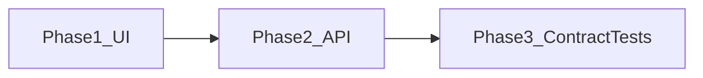

# EvoFirewall — полный hardening (UI → API → OpenAPI/тесты)

Выбор: **D** (полный поэтапный) + **удалить** [`apps/web/src/components/blocks/`](apps/web/src/components/blocks/).

Эталоны ReUI (обязательные ссылки по зонам):
- KPI / Quick Actions: [stats-12](https://reui.io/preview/base/stats-12) · [card-12](https://reui.io/preview/base/card-12)
- Lists: [data-grid-filtering-2](https://reui.io/preview/base/data-grid-filtering-2)
- Agents: [solution-agents-1](https://reui.io/preview/base/solution-agents-1)
- Settings: [settings-16](https://reui.io/preview/base/settings-16) · [settings-3](https://reui.io/preview/base/settings-3)
- Shell: [app-shell-12](https://reui.io/preview/base/app-shell-12)
- Empty / Auth callback: [empty-state-12](https://reui.io/preview/base/empty-state-12) · [auth-13](https://reui.io/preview/base/auth-13)
- Docs: [llms.txt](https://reui.io/llms.txt) · [MCP](https://reui.io/docs/mcp)

Перед UI-правками: MCP `user-reui` (`surface: frame`) + `validate_usage` / `get_audit_checklist`. После web: `pnpm --filter @evofw/web build`. После API: `pnpm --filter @evofw/api test`.

---

## Phase 1 — Frontend / ReUI

### 1.1 Dead code
- Удалить весь [`apps/web/src/components/blocks/`](apps/web/src/components/blocks/) (card-3, solution-agents-2/3, solution-crm-4, solution-inventory-9).
- Почистить комментарии-ссылки на `blocks/...` в domain (`agent-card.tsx` и др.) — оставить только `previewUrl` reui.io.
- Решить судьбу [`agents-fleet-chart.tsx`](apps/web/src/components/agents/agents-fleet-chart.tsx): **встроить** в dashboard (`/_auth/index.tsx`) как chart-секцию после Quick Actions (контракт KPI → QA → charts), иначе удалить. Выбор по умолчанию: **встроить** на dashboard (данные уже есть через `agents` / `recentStats`).

### 1.2 Project lock + kit wiring
- Добавить [`apps/web/src/lib/ui-surface.ts`](apps/web/src/lib/ui-surface.ts): `export const UI_SURFACE = 'frame' as const`.
- Подключить shared kit вместо ad-hoc:
  - [`LoadingButton`](apps/web/src/components/loading-button.tsx) — settings save, approve/delete mutations.
  - [`QueryState`](apps/web/src/components/query-state.tsx) — error/retry на lists/rules/agents где сейчас raw Alert+Button.
  - [`FormSheet`](apps/web/src/components/form-sheet.tsx) — миграция create/edit sheets (`add-agent-sheet`, list/rule create) **только если** API FormSheet совместим с текущими формами; иначе удалить FormSheet как мёртвый код (не держать orphan). Default: **мигрировать** `AddAgentSheet` + один list create; остальные — если fit без redesign.

### 1.3 `/agents` — убрать дубль toolbar
- Файл: [`routes/_auth/agents/index.tsx`](apps/web/src/routes/_auth/agents/index.tsx) (~19KB).
- Cards view сейчас hand-roll Tabs+Filters+Search (строки ~504–550); table уже через [`AgentFleetDataGrid`](apps/web/src/components/agents/agent-fleet-data-grid.tsx) → `ResourcePage`.
- Вынести общий toolbar (CountedLineTabs + Filters + search + viewToggle + clear) в shared helper/component (например `agents-fleet-toolbar.tsx`) **или** расширить `ResourcePage` slot `toolbarExtra` / `headerExtra` так, чтобы cards mode использовал тот же chrome, что table (без копипаста FramePanel).
- Preview: [data-grid-filtering-2](https://reui.io/preview/base/data-grid-filtering-2) · [solution-agents-1](https://reui.io/preview/base/solution-agents-1).

### 1.4 Settings
- [`SettingsShell`](apps/web/src/components/reui-kit/settings-shell.tsx) сейчас ведёт на несуществующие `/settings/appearance|integrations`.
- **Default:** один экран settings остаётся ([`routes/_auth/settings.tsx`](apps/web/src/routes/_auth/settings.tsx) — Frame + `SettingRow` по [settings-16](https://reui.io/preview/base/settings-16)); починить `SettingsShell` defaults (убрать фантомные табы / сделать configurable tabs без мёртвых href) **или** не экспортировать мёртвый shell до появления 2+ секций.
- Добавить gating Quick Actions: ключ settings `show_quick_actions` (default `true`) + UI SettingRow (Switch) + чтение на `/` и `/agents`. Backend whitelist ключа — в Phase 2 вместе с Zod settings.

### 1.5 Auth callback + docs sync
- [`auth.callback.tsx`](apps/web/src/routes/auth.callback.tsx) — Frame + Empty/loading по DNA [auth-13](https://reui.io/preview/base/auth-13) / [empty-state-12](https://reui.io/preview/base/empty-state-12) (без локального login — portal SSO).
- Поправить `.cursor/rules/frontend-*.mdc`: убрать/пометить отсутствующие `login.tsx`, `KanbanBoard`, `settings/integrations.tsx`.

### 1.6 Verify Phase 1
- `pnpm --filter @evofw/web build` (+ typecheck/lint если есть в package).

---

## Phase 2 — Backend correctness + structure

### 2.1 Critical bugfixes (сначала)
- **`bumpAgentsForList`**: при `setIds.length === 0` — **no-op**, не `bumpAllApprovedAgents` ([`packages/db/src/repositories/index.ts`](packages/db/src/repositories/index.ts)).
- **Zod `PUT /settings`**: whitelist ключей (`enroll_seed`, `evobgp_api_url`, `evobgp_api_token`, `agent_sync_interval_sec`, `show_quick_actions`, …) в `@evofw/shared`.
- **RBAC**: дополнить [`permissions.ts`](packages/shared/src/permissions.ts) — `install-links` → `fw:agents:*`, `integrations/*` → `fw:settings:read` / `fw:lists:read`.
- Тест на bump no-op + settings reject unknown key + RBAC 403.

### 2.2 N+1 / perf
- `GET /agents`: join/batch install links вместо per-row `getInstallLinkByAgentId`.
- `GET /lists` / policy-sets: batch counts (GROUP BY), не `listEntries().length` / dual count per row.
- `replaceIpListEntries` / `replaceResolvedForRule`: batch `values([...])`.

### 2.3 Split monoliths (как vps-tracker)
- Разрезать [`control.ts`](apps/api/src/routes/control.ts) (~1020 строк) → `routes/{agents,lists,policy-sets,rules,install-links,settings,integrations-evobgp,stats,dashboard}.ts` + thin register в `app.ts`.
- Разрезать [`repositories/index.ts`](packages/db/src/repositories/index.ts) → `repositories/{agents,lists,policy,stats,install-links,settings}.ts` + barrel.
- Вынести `mapAgent` / `mapPolicySet` / `mapPolicyRule` → `apps/api/src/services/row-mappers.ts`.
- Общий `uniq()` → один util.

### 2.4 Legacy hygiene (без breaking agent binary)
- Документировать `policy_mode` как deprecated read-only; не расширять usage.
- `domains` list type: UI/API уже нормализуют в `static` — убрать из новых create paths / labels где ещё светится.
- Не дропать колонки в этой фазе (отдельная migration later).

### 2.5 Verify Phase 2
- `pnpm --filter @evofw/api test` + smoke inject на approve/list/settings.

---

## Phase 3 — Contract + tests

### 3.1 OpenAPI
- Дописать [`docs/openapi.yaml`](docs/openapi.yaml) до паритета с реальными routes (agents, lists, policy-sets, rules, overrides, install-links, preview, stats, settings, integrations, agent enroll/policy/apply).
- Пометить в [`docs/README.md`](docs/README.md): OpenAPI = SoT для HTTP; живой runtime validation = Zod shared.
- CI: redocly lint (по паттерну EvoBGP) — добавить job/script если CI уже есть.

### 3.2 Error envelope
- Унифицировать SPA 404 и API errors на один формат `{ error: { code, message } }` (текущий API) **или** problem+json везде. Default: **оставить API `{error}`**, поправить SPA fallback в [`app.ts`](apps/api/src/app.ts) под тот же envelope.

### 3.3 Test belt
- Inject tests: agents CRUD approve/revoke, policy rule create+reorder, list refresh bump, settings whitelist, RBAC install-links/integrations, `bumpAgentsForList` unused list.
- Не гнаться за 100% coverage — critical paths only.

### 3.4 Verify Phase 3
- API tests green; OpenAPI lint; web build still green.

---

## Out of scope (явно)
- Локальный login page (SSO portal).
- KanbanBoard (нет домена board в EvoFirewall).
- Drop DB columns `policy_mode` / migrate all `domains` rows (отдельный breaking change).
- Prefix-overlap conflict resolution в evaluate (менять семантику только отдельным RFC).
