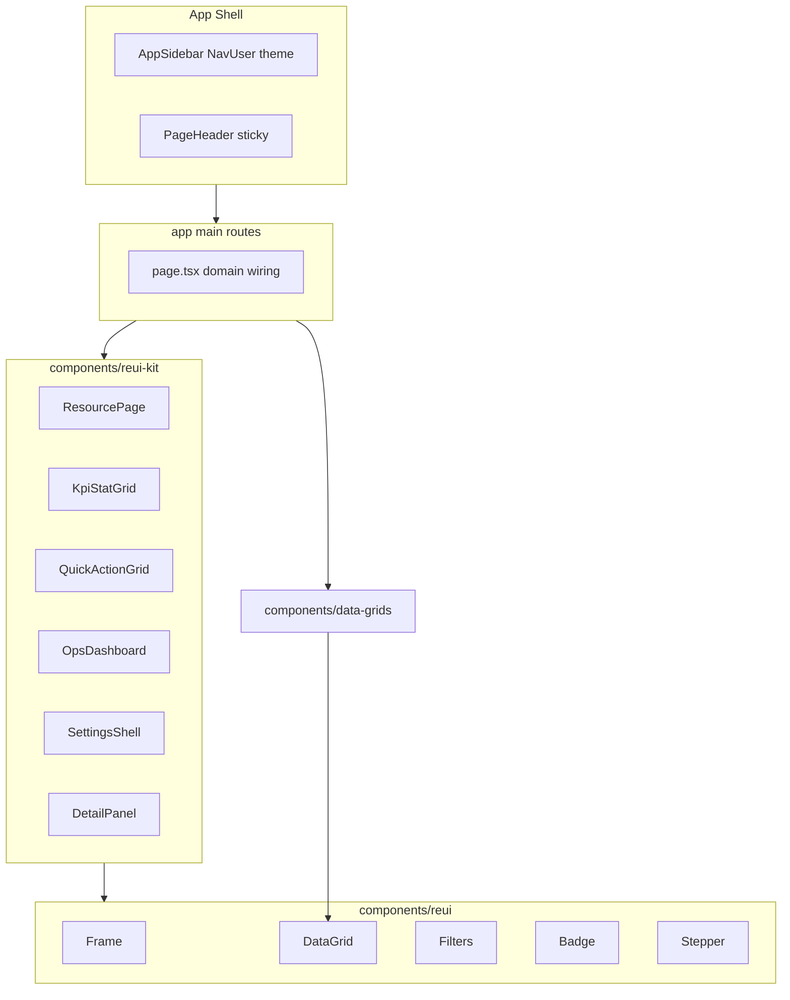

# MikrotikManager → ReUI PRO (мастер-план)

## Вердикт

Проект **уже на полпути**: `base-nova`, `@reui` registry, `REUI_LICENSE_KEY`, MCP/`reui` skill, ~33 domain DataGrid на ReUI. Главный разрыв с ops-contract (EvoBGP/vps/CFDM): **shell списков = shadcn Card** ([`DataPageCard`](c:/Users/shats/Dev/MikrotikManager-3/components/data-page-card.tsx)), **Frame не используется**, **нет `reui-kit`**, KPI — hand-roll Card. Стек остаётся **Next.js 16 App Router** (не Vite monorepo).

## Зафиксированные решения

| Решение | Выбор |
|---------|--------|
| Surface lock | `frame` (не Card) |
| Runtime | Next.js 16 + `@/components/ui` + `@/components/reui` |
| Kit SoT | Порт DNA из EvoBGP (`KpiStatGrid`, `QuickActionGrid`, `ResourcePage`, `OpsDashboard`, `SettingsShell`, `DetailPanel`) → `components/reui-kit/` |
| **KPI (все волны)** | **Только hybrid** как в EvoBGP / vps / CFDM / EvoFirewall / auth-portal: `reui-kit/KpiStatGrid` (DNA [stats-12](https://reui.io/preview/base/stats-12)). Markup 1:1 с EvoBGP — менять только import path |
| API / UX behavior | Без изменений контрактов ([`docs/refactor-baseline.md`](c:/Users/shats/Dev/MikrotikManager-3/docs/refactor-baseline.md)) |
| App Switcher / auth-portal | **Вне scope** этой миграции (MM standalone); chrome только выравниваем под contract |
| Эталон | `/servers` остаётся эталоном — после Wave A+B **обновляется** под Frame + **hybrid KPI** |

## Целевая архитектура UI

**Замена surface:** `DataPageCard` (Card) → Frame-обёртка (например `DataPageFrame` / `ResourcePage`), без смешивания Card+Frame на ops-экране.

## KPI hybrid — жёсткий контракт (все подпланы A–G)

Как в старых ops-apps. SoT markup: EvoBGP `apps/web/src/components/reui-kit/kpi-stat-grid.tsx`. Preview: [stats-12](https://reui.io/preview/base/stats-12). Rule: `kpi-hybrid.mdc`.

**MUST**

- Любая KPI-полоса / metric strip → только `components/reui-kit/KpiStatGrid` (через `OpsDashboard` / `DetailPanel.Metrics` при наличии)
- Horizontal compact hybrid: icon left `Item` `size-10.5` `bg-muted` + `border-background` + shadow + `ItemMedia` + label/Badge + value ± `variant`
- Row icon tiles в data-grid — та же DNA (semantic `text-*` на `bg-muted`)
- Quick Actions — только `QuickActionGrid` (sibling hybrid DNA), не Card/Button grid

**NEVER (ни в одной волне)**

- `StatCard` / SectionCards / vertical-only KPI / hand-roll Frame/Card KPI grid
- `stats-7` / `stats-1` / `card-35` как замена hybrid KPI
- Solid brand fill вместо `bg-muted`; raw `bg-emerald-*` / `text-emerald-*`
- Копипаст ReUI block KPI в route — только adapt через kit

Мягкие формулировки «KPI если есть» = **если метрики на экране есть — только hybrid `KpiStatGrid`**, иначе блок не рисуем.

## Canonical ReUI refs (MCP `surface: frame`)

| Зона | Block / DNA | Preview |
|------|-------------|---------|
| Shell | `app-shell-12` (+ monitor/cmdk DNA) | https://reui.io/preview/base/app-shell-12 |
| KPI | **hybrid only** stats-12 (EvoBGP SoT) | https://reui.io/preview/base/stats-12 |
| Lists | `data-grid-filtering-2` / `data-grid-filtering-1` | https://reui.io/preview/base/data-grid-filtering-2 |
| Dashboard | `dashboard-1` | https://reui.io/preview/base/dashboard-1 |
| Settings | `settings-16` + `settings-3` | https://reui.io/preview/base/settings-16 |
| Empty | `empty-state-12` / shadcn Empty | https://reui.io/preview/base/empty-state-12 |
| Forms Sheet | `form-7` DNA | https://reui.io/preview/base/form-7 |

Docs: https://reui.io/llms.txt · https://reui.io/docs/get-started · https://reui.io/docs/styling · https://reui.io/docs/mcp

## Workflow на каждую волну (обязательный)

1. MCP `user-reui`: `search` / `compose_page` / `get_block` / `get_component` с `surface: "frame"`
2. CLI из корня MM: `npx shadcn@latest add @reui/<name> --yes` (или `--dry-run` перед overwrite)
3. Adapt → `reui-kit` / route; **не** копипаст block в `page.tsx`
4. `validate_usage` + `get_audit_checklist`
5. Gate: `npm run lint` + визуальная сверка с `/servers` (после его миграции) + `npm run build` на milestone

## Волны = отдельные подпланы

Не выполнять всё одним PR. Каждый подплан — свой scope, DoD и PR(ы).

| ID | Подплан | Scope (кратко) |
|----|---------|----------------|
| **A** | [Foundation](mm_reui_foundation_8b1c5482.plan.md) | Contract, **kpi-hybrid**, порт hybrid `KpiStatGrid`, Frame shell, chrome |
| **B** | [Etalon + simple lists](mm_reui_lists_simple_d9c1b930.plan.md) | `/servers` эталон Frame + **hybrid KPI** + simple lists |
| **C** | [CRUD lists medium](mm_reui_lists_medium_1a708596.plan.md) | Medium CRUD: Frame + **hybrid KPI** |
| **D** | [Dashboard & overview](mm_reui_dashboard_b54ab10d.plan.md) | `/dashboard` `/traffic`: StatCard → **hybrid** |
| **E** | [Network ops](mm_reui_network_ops_e8a979a4.plan.md) | Network giants: Frame + **hybrid KPI** |
| **F** | [System](mm_reui_system_9c5741cb.plan.md) | Settings/alerts/…: Frame + **hybrid** где есть метрики |
| **G** | [Special surfaces](mm_reui_special_04f7eebc.plan.md) | Map/terminal/uptime/optimizer: Frame + **hybrid KPI** |

Порядок: **A → B → C → D**, затем **E∥F** (параллельно разными PR), затем **G**.

## Инварианты

- Не менять API shape / бизнес-логику backend
- Не ломать ReUI DataGrid shell без нужды — переиспользовать [`DataGridShell`](c:/Users/shats/Dev/MikrotikManager-3/components/data-grids/shared/data-grid-shell.tsx)
- **KPI: только hybrid `KpiStatGrid` (EvoBGP DNA)** — см. секцию выше; действует на волны B–G
- Запрет: Card как ops list shell; hand-roll / Card / SectionCards KPI; `space-y-*`; raw `bg-emerald-*`
- Giant pages (>1500 LOC): сначала вынос секций в компоненты, потом Frame — не «big bang rewrite»

## Документы / rules (часть Wave A)

- Добавить [`docs/ui-design-contract.md`](c:/Users/shats/Dev/MikrotikManager-3/docs/ui-design-contract.md) (адапт EvoBGP contract под MM paths)
- Cursor rules: `reui-mcp.mdc`, `kpi-hybrid.mdc`, обновить `next-shadcn-production.mdc` (эталон после Wave B)
- `AGENTS.md` — секция ReUI + команды CLI

## Риски

- **PRO license** нужна для premium blocks; free components уже стоят
- Overwrite shadcn CLI на существующие `components/reui/*` — всегда `--dry-run` / diff
- Giant pages (`alerts` ~3k, `uptime` ~2.7k) — отдельный подплан, иначе регрессии
- Theme: сейчас toggle в sidebar footer кастомный → NavUser segmented (contract)

## Definition of Done (весь продукт)

- Все ops-экраны на Frame surface; Card только где нужен interactive container внутри, не как page shell
- Все KPI-полосы — **hybrid** `KpiStatGrid` (идентично EvoBGP/vps/CFDM/FW); lists через Frame + DataGrid (+ Filters где есть)
- `/servers` = актуальный эталон под ReUI PRO
- Rules + `ui-design-contract.md` в репо
- Lint/build зелёные на milestone после каждой волны
