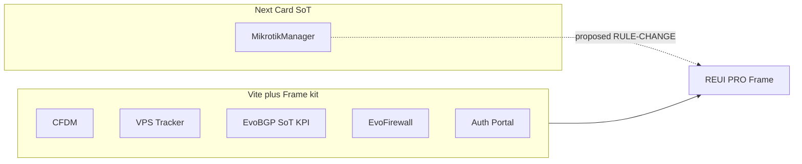

# UX/UI Unification — Audit Complete, Plan File Next

## Scope of this phase

После подтверждения плана будет создан **только** [`c:\Users\shats\Dev\vps-tracker\UX-UI-PLAN.md`](c:/Users/shats/Dev/vps-tracker/UX-UI-PLAN.md) (выбрано пользователем). Production/source code, зависимости, CSS и компоненты **не изменяются**. Implementation UI — отдельный запрос.

Источники истины для references: [reui.io/docs](https://reui.io/docs), [reui.io/llms.txt](https://reui.io/llms.txt), MCP `user-reui` (`get_block` / `list_components` / `compose_page` / `get_component`). Skill ReUI локально и в MCP: `668fb463eb` (совпадает). Версию ReUI PRO **не** указываем — её нет.

## Coverage gate

`Discovered: 6` · `Audited: 6` · `Planned: 6` · `Coverage: 100%`

| # | Project | Path | Type | UI |
|---|---|---|---|---|
| 1 | VPS Tracker | `c:\Users\shats\Dev\vps-tracker` | fullstack Vite SPA | Frame + kit, mixed Card on charts/detail |
| 2 | Cloudflare Domain Manager | `c:\Users\shats\Dev\cloudflare-domain-manager` | fullstack Vite SPA | Frame-first, closest to contract |
| 3 | EvoBGP | `c:\Users\shats\Dev\EvoBGP` | fullstack (Go API + Vite SPA) | SoT hybrid KPI; leftover Card on stub/empty |
| 4 | Auth Portal | `c:\Users\shats\Dev\auth-portal` | fullstack Vite SPA | Frame admin; thin kit; no SystemMonitor |
| 5 | EvoFirewall | `c:\Users\shats\Dev\EvoFirewall` | fullstack Vite SPA | Frame + kit; SettingsShell unused |
| 6 | MikrotikManager | `c:\Users\shats\Dev\MikrotikManager-3` | fullstack Next.js 16 | **Card SoT `/servers`**; ReUI partial (data-grid/filters/stepper), **нет** `reui-kit` |

Backend-only проектов нет. Все шесть — frontend/fullstack UI.

## What the final file will contain

Полная структура из правила аудита (§37): Executive Summary, Coverage, Inventory, MCP/Skills, Rules, 6 project audits, Cross-project matrix, Duplicates, REUI Registry, Target rules, CHANGE-XXX, Roadmap, Acceptance, Risks, Consistency Gate.

Ниже — ядро находок, которые попадут в файл с evidence и Ref ID.

## Что будет одинаковым, а что нет (решение пользователя)

Уровень унификации: **система + идентичный chrome во всех 6 приложениях**. Доменные экраны **не** копируются.

### Будет одинаковым (chrome identity — все 6, включая Auth Portal и MikrotikManager)

Эталон: [app-shell-12](https://reui.io/preview/base/app-shell-12) + [app-shell-7](https://reui.io/preview/base/app-shell-7) (SystemMonitor) + [app-shell-1](https://reui.io/preview/base/app-shell-1) (NavUser).

- Sidebar `--sidebar-width: 240px`
- Sidebar header: App Switcher (ids `cfdm` · `vps` · `bgp` · `fw` · `dns`, источник — auth-portal API)
- Sidebar footer: **NavUser** + segmented theme (light / dark / system), без Sun/Moon icon toggle
- Header right: **AppsMenu → SystemMonitorPopover**; без ModeToggle и без Search-кнопки (поиск только ⌘K)
- Main padding: `gap-4 md:gap-6`, `px-4 py-4 md:px-6 md:py-5`
- Тема: next-themes (или эквивалент с тем же UX) + ReUI semantic tokens (`--success/--warning/--info/--invert`)
- SSO/portal: вход через auth-portal, тот же App Switcher

Сейчас этого нет: Auth Portal (нет SystemMonitor), MikrotikManager (нет AppsMenu/NavUser/switcher, icon theme toggle).

### Будет одним паттерном (не pixel-copy страниц)

- Surface ops-экрана: Frame, не Card
- Списки: DataGrid + Filters
- KPI: stats-12 + IconTile `elevated`
- Quick Actions: Frame tiles (card-12 DNA)
- Settings rows: settings-3 / integrations: settings-16
- Create/edit: Sheet (sheet-8 / sheet-1 / sheet-9)
- Empty: Empty + IconStack, Frame-friendly

Одинаковый **рецепт**, разные данные, колонки, фильтры, действия.

### Останется разным (домен)

- VPS: topology canvas, BILLmanager sync, тарифы, баланс
- CFDM: DNS, kanban групп/сервисов, сертификаты Cloudflare
- EvoBGP: modules/lookup/BIRD jobs/network
- Auth Portal: login, users/OIDC/audit (это IdP, не ops CRUD)
- EvoFirewall: agent fleet cards, policy sortable, blocklists
- MikrotikManager: `/servers` CRUD, terminal, network-map, контейнеры — **функциональность** та же, chrome и surface выравниваются
- Framework: Vite SPA vs Next.js 16 — **не** меняем ради UI
- Package scopes (`@cfdm/ui`, `@evobgp/ui`, …) — не сливать в один npm без отдельного technical решения

## Critical cross-project findings

1. **Две дизайн-системы в одном workspace.** Пять Vite-приложений уже lock `surface: frame` + `reui-kit`. MikrotikManager — Next App Router, SoT [`/servers`](c:/Users/shats/Dev/MikrotikManager-3/app/(main)/servers/page.tsx) на `DataPageCard` → shadcn Card. Правила `next-shadcn-production.mdc` / `ma-ui-guardian.mdc` **противоречат** цели унификации. UX/UI rule разрешено менять: target = Frame + DataGrid, **без** смены Next.js (technical constraint).

2. **KPI DNA устарела относительно официального primitive.** Сейчас kit использует hand-roll `Item` `size-10.5` `bg-muted` и ссылается на [stats-12](https://reui.io/preview/base/stats-12) (MCP: Frame + Badge + Item). Официальный primitive [Icon Tile](https://reui.io/docs/components/base/icon-tile) (`variant="elevated"`, preview [icon-tile](https://reui.io/components/icon-tile)) закрывает ту же задачу. **Ни один** из 6 проектов не установил `icon-tile`. Match текущий KPI → stats-12: **partial**. Target: IconTile elevated + stats-12 composition.

3. **settings-7 — Card surface.** EvoBGP kit/reference [`settings-7`](https://reui.io/preview/base/settings-7) официально `surface: card`. Это нарушает Frame lock. Frame-эталоны: [settings-3](https://reui.io/preview/base/settings-3), [settings-8](https://reui.io/preview/base/settings-8), [settings-16](https://reui.io/preview/base/settings-16).

4. **Chrome drift.** Контракты цитируют [app-shell-12](https://reui.io/preview/base/app-shell-12). MCP `compose_page` для ops dashboard вернул **app-shell-7** ([preview](https://reui.io/preview/base/app-shell-7)) — в описании есть system monitor popover, ближе к реальному `SystemMonitorPopover`. Auth Portal: AppsMenu без SystemMonitor. MikrotikManager: нет AppsMenu / NavUser / auth-portal switcher; theme = icon toggle в sidebar.

5. **Дубли kit.** `KpiStatGrid` / `QuickActionGrid` / `ResourcePage` / `OpsDashboard` скопированы в 5 репо (`@cfdm/ui` vs `@evobgp/ui` vs `@evofw/ui` vs `@authportal/ui`). Нет shared package. Unification UX — через одинаковые rules + DNA; общий npm-пакет = отдельный technical risk (не ломаем package boundaries в этом плане).

6. **Мёртвый / недоиспользованный kit.** SettingsShell и DetailPanel экспортируются, но не используются в EvoBGP routes и частично в EvoFirewall. Auth Portal `ResourcePage` — stub. CFDM ближе всех к контракту (Card не импортируется в `apps/web`).

7. **Rules drift.** Правила перечисляют ReUI-компоненты, которых нет на диске (kanban в vps-tracker, stepper unused в FW, Frame unused в MM). `kpi-hybrid.mdc` дублируется 5 раз. CFDM нет `AGENTS.md` / `ui-surface.ts`. Auth contract ids без `dns`, код включает `dns`.

## Verified REUI PRO registry (will expand in file)

Каждый CHANGE получит Ref ID. Уже подтверждено MCP `get_block` / `list_components` / official docs:

| Ref | Item | Official docs | Preview | Typical match |
|---|---|---|---|---|
| REUI-001 | Frame | [docs/components/base/frame](https://reui.io/docs/components/base/frame) | [components/frame](https://reui.io/components/frame) | 1:1 for ops surface |
| REUI-002 | Data Grid | [docs/components/base/data-grid](https://reui.io/docs/components/base/data-grid) | [components/data-grid](https://reui.io/components/data-grid) | 1:1 lists; MCP: TanStack v9 |
| REUI-003 | Filters | [docs/components/base/filters](https://reui.io/docs/components/base/filters) | [components/filters](https://reui.io/components/filters) | 1:1 |
| REUI-004 | stats-12 | [blocks](https://reui.io/blocks) | [preview/base/stats-12](https://reui.io/preview/base/stats-12) | partial vs current Item hybrid |
| REUI-005 | Icon Tile | [docs/components/base/icon-tile](https://reui.io/docs/components/base/icon-tile) | [components/icon-tile](https://reui.io/components/icon-tile) | target for KPI/row tiles |
| REUI-006 | data-grid-filtering-2 | [blocks](https://reui.io/blocks) | [preview/base/data-grid-filtering-2](https://reui.io/preview/base/data-grid-filtering-2) | partial (kit ResourcePage) |
| REUI-007 | settings-16 | [blocks/application/settings](https://reui.io/blocks/application/settings) | [preview/base/settings-16](https://reui.io/preview/base/settings-16) | integrations |
| REUI-008 | settings-3 | same category | [preview/base/settings-3](https://reui.io/preview/base/settings-3) | settings rows Frame |
| REUI-009 | settings-8 | same | [preview/base/settings-8](https://reui.io/preview/base/settings-8) | webhook-like lists |
| REUI-010 | app-shell-12 | [blocks](https://reui.io/blocks) | [preview/base/app-shell-12](https://reui.io/preview/base/app-shell-12) | current chrome cite |
| REUI-011 | app-shell-7 | [blocks](https://reui.io/blocks) | [preview/base/app-shell-7](https://reui.io/preview/base/app-shell-7) | better SystemMonitor match |
| REUI-012 | app-shell-1 | [blocks](https://reui.io/blocks) | [preview/base/app-shell-1](https://reui.io/preview/base/app-shell-1) | NavUser |
| REUI-013 | card-12 | [blocks](https://reui.io/blocks) | [preview/base/card-12](https://reui.io/preview/base/card-12) | Quick Actions |
| REUI-014 | dashboard-1 | [blocks](https://reui.io/blocks) | [preview/base/dashboard-1](https://reui.io/preview/base/dashboard-1) | OpsDashboard |
| REUI-015 | empty-state-14 | [blocks](https://reui.io/blocks) | [preview/base/empty-state-14](https://reui.io/preview/base/empty-state-14) | Frame empty (prefer over card empty-state-11) |
| REUI-016 | empty-state-12 | [blocks](https://reui.io/blocks) | [preview/base/empty-state-12](https://reui.io/preview/base/empty-state-12) | current cite; surface none |
| REUI-017 | sheet-8 / sheet-1 / sheet-9 | [blocks](https://reui.io/blocks) | [sheet-8](https://reui.io/preview/base/sheet-8) [sheet-1](https://reui.io/preview/base/sheet-1) [sheet-9](https://reui.io/preview/base/sheet-9) | create/edit/detail sheets |
| REUI-018 | auth-13 | [blocks](https://reui.io/blocks) | [preview/base/auth-13](https://reui.io/preview/base/auth-13) | Frame login |
| REUI-019 | auth-18 | [blocks](https://reui.io/blocks) | [preview/base/auth-18](https://reui.io/preview/base/auth-18) | auth-portal actual; surface none |
| REUI-020 | solution-users-1 / 6 | [blocks](https://reui.io/blocks) | [users-1](https://reui.io/preview/base/solution-users-1) [users-6](https://reui.io/preview/base/solution-users-6) | auth admin |
| REUI-021 | form-7 | [blocks](https://reui.io/blocks) | [preview/base/form-7](https://reui.io/preview/base/form-7) | inline detail Frame |
| REUI-022 | chart-15 | [blocks](https://reui.io/blocks) | [preview/base/chart-15](https://reui.io/preview/base/chart-15) | Frame charts (replace Card chart shells) |
| REUI-023 | kanban / sortable / stepper / timeline / autocomplete | primitive docs under `/docs/components/base/<name>` | matching `/components/<name>` | domain-specific |

`settings-7` **не** будет target (Card). `empty-state-11` **не** будет target (Card).

## Target UX/UI rules (summary)

- **TARGET-001:** Один surface на ops-экран: ReUI Frame. Не смешивать Card+Frame.
- **TARGET-002:** Списки = DataGrid + Filters внутри Frame ([data-grid-filtering-2](https://reui.io/preview/base/data-grid-filtering-2)). Запрет raw `<table>` / shadcn Table как ops list.
- **TARGET-003:** KPI = stats-12 composition + IconTile `elevated` (не hand-roll Item tile). Semantic `text-*` / Badge variants, не `bg-emerald-*`.
- **TARGET-004:** Quick Actions = Frame tiles sibling KPI ([card-12](https://reui.io/preview/base/card-12) + stats-12 DNA).
- **TARGET-005:** Settings rows = settings-3; integrations = settings-16; не settings-7.
- **TARGET-006 (P0, все 6 приложений):** Chrome identity 1:1. Sidebar 240px + App Switcher; header AppsMenu → SystemMonitor; footer NavUser segmented theme. Эталон: [app-shell-12](https://reui.io/preview/base/app-shell-12) + [app-shell-7](https://reui.io/preview/base/app-shell-7) + [app-shell-1](https://reui.io/preview/base/app-shell-1). Auth Portal и MikrotikManager **не** исключение.
- **TARGET-007:** Create/edit = Sheet blocks (sheet-8 create/settings, sheet-1 create, sheet-9 detail). Confirm = Alert Dialog examples ([alert-dialog](https://reui.io/components/alert-dialog)).
- **TARGET-008:** Empty = Empty + IconStack, Frame-friendly empty-state-14 / empty-state-12; не Card empty-state-11.
- **TARGET-009:** MikrotikManager UX SoT сменить с Card `/servers` на Frame+DataGrid **при сохранении** всего CRUD `/servers` (technical: остаётся Next.js).
- **TARGET-010:** Rules синхронизировать с диском (не перечислять неустановленные компоненты как «установленные»).

## Change themes per project (detail in file)

**VPS Tracker (P1):** Card shells на `vps.$vpsId`, `reports`, `resources`, `renewals`, charts → Frame / chart-15. `spaces.tsx` shadcn Table → ResourcePage/DataGrid. SettingsShell Separator. Dashboard QA order — зафиксировать как exception или выровнять с EvoBGP.

**CFDM (P2):** Наименьший gap. Добавить `ui-surface.ts` / AGENTS.md. IconTile вместо Item tiles. Удалить naming `*KpiCards`.

**EvoBGP (P1):** `modules/new.tsx` Card stub → Frame. `illustrated-empty-state` Card → empty-state-14. Подключить SettingsShell/DetailPanel или удалить из barrel. Forms: RHF в package.json, в src не используется — выровнять на Field + sheet-8.

**Auth Portal (P0 chrome / P1 pages):** Добавить SystemMonitorPopover в header (сейчас только AppsMenu). NavUser уже segmented — оставить. `/apps` tiles → QuickActionGrid. ResourcePage stub. Contract + `dns` id. Login-страница **без** AppShell остаётся отдельным auth surface ([auth-18](https://reui.io/preview/base/auth-18) / [auth-13](https://reui.io/preview/base/auth-13)); chrome identity применяется только к `_auth` shell.

**EvoFirewall (P1/P2):** `/settings` → SettingsShell или явно REPLACE rule. Agent cards view оставить как Frame domain, не Card. IconTile для AgentPlatformIcon. Orphans: lifecycle timeline, FormFieldSimple, unused stepper.

**MikrotikManager (P0 chrome, P1 surface, high risk):** Сначала chrome identity: AppsMenu, SystemMonitor, NavUser segmented, App Switcher `dns`/`fw`/…, `--sidebar-width: 240px` (сейчас hand-rolled footer + Sun/Moon). Затем RULE-CHANGE SoT: `DataPageCard` Card → Frame. KPI → stats-12 + IconTile. Не мигрировать Next.js. Сохранить весь CRUD `/servers` и остальные страницы.

## Roadmap (in file, not executed now)

- Phase 0: этот план-файл (единственный deliverable сейчас)
- Phase 1: **Chrome identity во всех 6** (Auth SystemMonitor; MM AppsMenu/NavUser/Switcher; Vite — сверка 1:1)
- Phase 2: shared rules + IconTile + Frame lock (Vite + начало MM)
- Phase 3: kit DNA (KPI/QA/ResourcePage) per repo
- Phase 4: page-level Card→Frame (VPS charts/detail, BGP stub/empty, MM DataPageCard)
- Phase 5: states (empty/loading/error) + sheets
- Phase 6: a11y/responsive verification

## Constraints to preserve

Не трогать: API contracts, auth/SSO/OIDC, permissions, TanStack vs Next routing, Go vs Fastify, package names, CRUD поведения (create/edit/delete/sync/filter/sort/pagination).

Technical dependency (отдельная секция Risks): Data Grid docs говорят TanStack Table **v9**; установленный `@reui/data-grid` в проектах может быть v8 — не ломать kit без явной миграции (`<uncertain>` до проверки `package.json` каждого web-приложения в тексте плана).

## After approval

Написать полный `UX-UI-PLAN.md` (~все секции правила, CHANGE-XXX с Ref ID и прямыми URL). Остановиться. Implementation — только по отдельному запросу.
